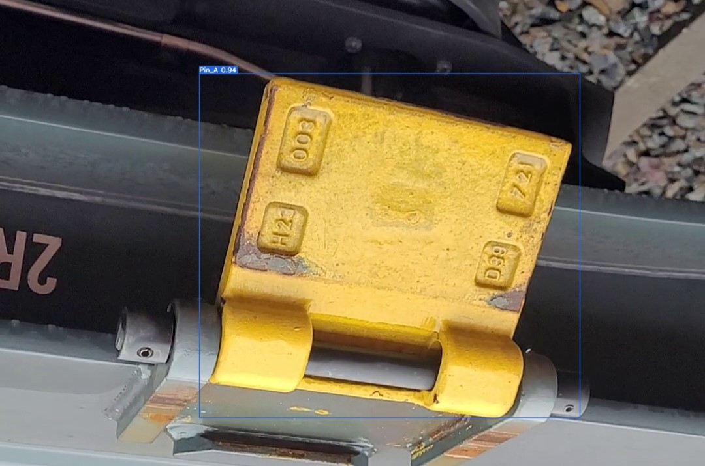

#  Custom Pin Detector Using Yolov7

      

# installation:

## 1- Docker environment (recommended):

1. pull the image from Docker hub. 
    - 
    ~~~bash
    $ docker pull aboneda/yolocustommodel:latest
    ~~~

2. Run the image: 
    ~~~bash
    $ docker run yolocustommodel:latest --weights yolov7.pt --data data/custom.yaml   --device 0  --batch-size 8 --cfg cfg/training/custom_cfg.yaml --name yolo7 --epochs 10
    ~~~
    
## 2- Local Installation:

1. Clone the repository. 
    - 
    ~~~bash
    $ git clone -b custom_model git@gitlab.cc-asp.fraunhofer.de:cml-160/pin-handling-mr/pin-handling-mr_sw/computer-vision/pin-classification.git
    ~~~
2. install requirements:
    -
    ~~~bash
    $ pip install -r requirements.txt
    ~~~
3. Start training model
    -
    ~~~bash
    $ python train.py --weights yolov7.pt --data data/custom.yaml   --device 0  --batch-size 8 --cfg cfg/training/custom_cfg.yaml --name yolo7 --epochs 10
    ~~~

## 3- Testing the model:

     
~~~bash
    $ python detect.py --weights "trained_model_weights" --source "test_img_path"
~~~
ie. 
~~~bash
    $ python detect.py --weights runs/train/yolo714/weights/best.pt --source custom_pin_dataset/test/images/pin_A_2998.jpg
~~~

## 4- Customize the model:
...

